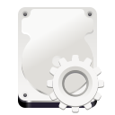
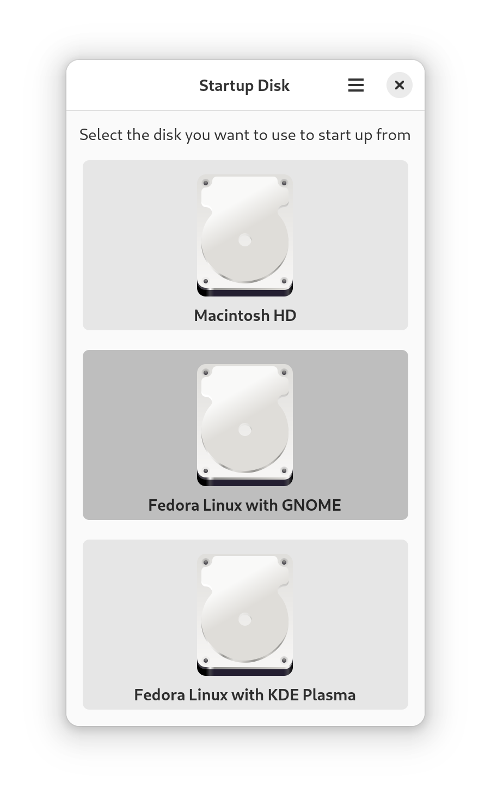

# Startup Disk

Startup Disk provides a simple interface to choose the startup volume on Apple Silicon Macs running [Asahi Linux](https://asahilinux.org/).

## Status

Basic functionality is implemented and works. While Startup Disk should be safe in normal operation, error checking is minimal to nonexistent. In particular, races and corruption are possible if multiple writers attempt to access the NVRAM at the same time -- do not run multiple copies of Startup Disk at the same time, and do not run Startup Disk concurrently with `asahi-bless`, `asahi-nvram` or other tools that access the NVRAM. If something goes _very_ wrong, you might have to perform a [DFU restore](https://support.apple.com/guide/apple-configurator-mac/revive-or-restore-a-mac-with-apple-silicon-apdd5f3c75ad/mac).

## Contributing

I'm mostly writing this as an excuse to teach myself [Rust](https://www.rust-lang.org/). While I'm striving to follow best practices, this is likely not the codebase you want to use for inspiration, at least at this stage.

Contributions and feedback via [issues](https://gitlab.gnome.org/davide125/startup-disk/-/issues) and [MRs](https://gitlab.gnome.org/davide125/startup-disk/-/merge_requests) are always appreciated. Please follow the [GNOME Code of Conduct](https://conduct.gnome.org/) when participating in project spaces.

## License

Startup Disk is [MIT](https://spdx.org/licenses/MIT.html) licensed. See the [LICENSE](LICENSE) file for the full text of the license.

## Credits

Startup Disk is a GUI around [asahi-bless](https://crates.io/crates/asahi-bless) implemented with [gtk-rs](https://gtk-rs.org/) and [libadwaita-rs](https://crates.io/crates/libadwaita). See the [Cargo manifest](Cargo.toml) for additional dependencies that Startup Disk relies on.

The [application icon](res/org.startup_disk.StartupDisk.svg) is a derived work of the Adwaita [hard disk icon](https://gitlab.gnome.org/GNOME/adwaita-icon-theme/-/blob/gnome-45/Adwaita/scalable/devices/drive-harddisk.svg) and the [GNOME Settings icon](https://gitlab.gnome.org/GNOME/gnome-control-center/-/blob/gnome-45/data/icons/hicolor/scalable/apps/org.gnome.Settings.svg); it was created using [Inkscape](https://inkscape.org/) and [App Icon Preview](https://gitlab.gnome.org/World/design/app-icon-preview); the latter was also used to create the [Devel variant](res/org.startup_disk.StartupDisk.Devel.svg).
